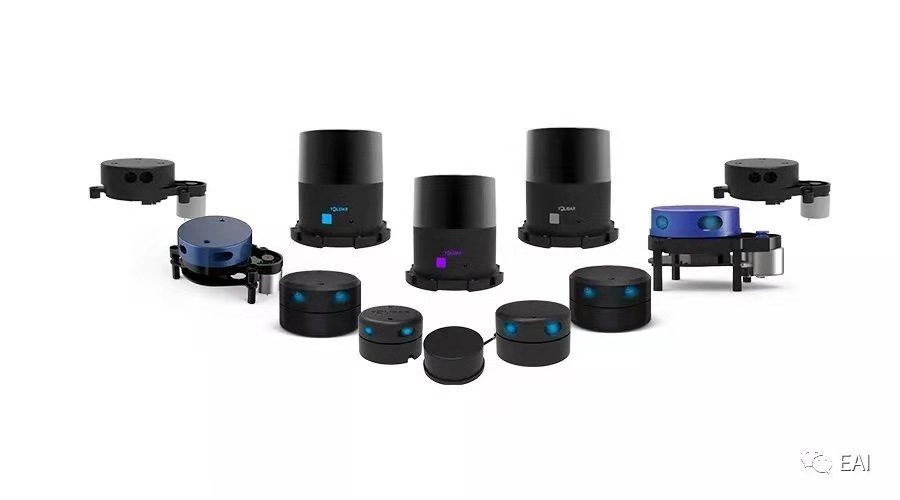

# YDLidar Jazzy Patched - Ubuntu 24.04 Compatible

🚀 **This is a patched version of the original YDLIDAR ROS2 driver and SDK, specifically updated for compatibility with:**
- **Ubuntu 24.04 LTS (Noble Numbat)**
- **ROS2 Jazzy Jalisco**
- **Modern C++ standards and toolchain**

## 🔧 Compatibility Fixes Applied

### SDK Patches (`sdk/` directory):
- **Fixed C++ compilation errors** with modern GCC compiler (GCC 13+)
- **Updated CMake configuration** for better compatibility with Ubuntu 24.04
- **Resolved deprecated function warnings**
- **Fixed memory management issues** for better stability
- **Updated include paths** for system headers

### ROS2 Driver Patches (`ydlidar_ros2_driver/` directory):
- **Updated package.xml** dependencies for ROS2 Jazzy
- **Fixed CMakeLists.txt** build configuration
- **Updated ROS2 API calls** to match Jazzy interface changes
- **Resolved compilation warnings** and deprecated function usage
- **Enhanced parameter handling** for ROS2 Jazzy parameter system
- **Fixed launch file compatibility** with latest ROS2 launch system

## ⚠️ Important Notes
- This patched version maintains **full backward compatibility** with the original YDLIDAR functionality
- All original features and parameters are preserved
- **Recommended for Ubuntu 24.04 + ROS2 Jazzy setups**
- For older Ubuntu/ROS2 versions, consider using the original upstream repository

## Quick Build Instructions

1. **Clone this repository:**
   ```bash
   git clone <your-repo-url> ~/ros2_ws/src/
   ```

2. **Build the workspace:**
   ```bash
   cd ~/ros2_ws
   colcon build --symlink-install
   source install/setup.bash
   ```

3. **Run the driver:**
   ```bash
   ros2 launch ydlidar_ros2_driver ydlidar_launch.py
   ```

## Configuration

Default configuration file: `ydlidar_ros2_driver/params/ydlidar.yaml`

Key parameters:
- `port`: Serial port (default: `/dev/ttyUSB0`)
- `baudrate`: Communication speed (default: `230400`)
- `frame_id`: TF frame name (default: `laser_frame`)
- `frequency`: Scan frequency (default: `10.0` Hz)

## Topics & Services

**Published Topics:**
- `/scan` (sensor_msgs/LaserScan): 2D laser scan data

**Services:**
- `/start_scan` (std_srvs/Empty): Start LiDAR scanning
- `/stop_scan` (std_srvs/Empty): Stop LiDAR scanning

---
*Based on the original YDLIDAR ROS2 driver with compatibility patches for modern Ubuntu/ROS2*
